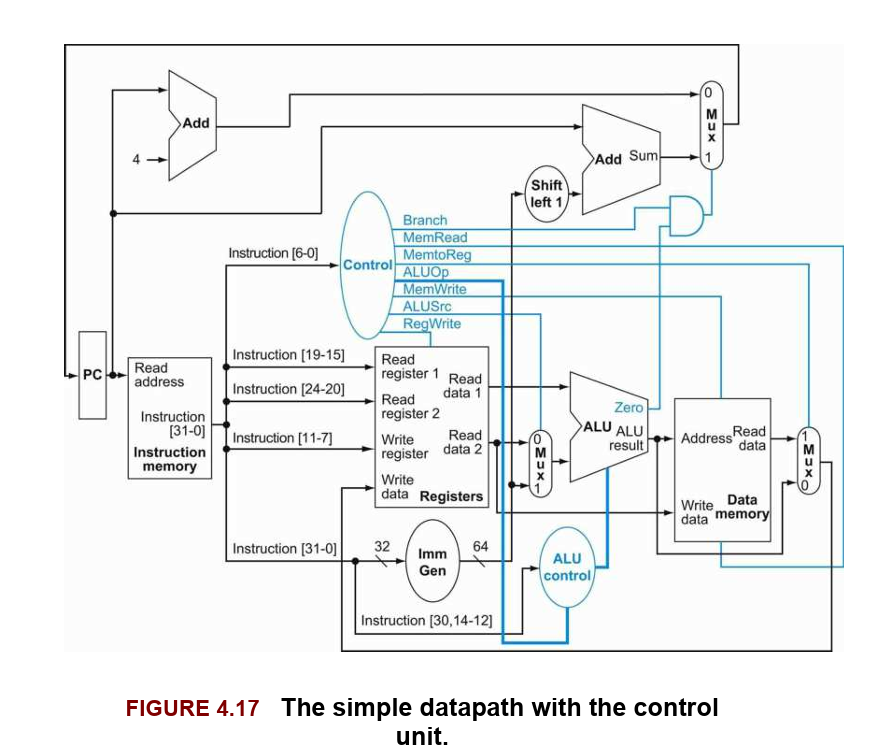
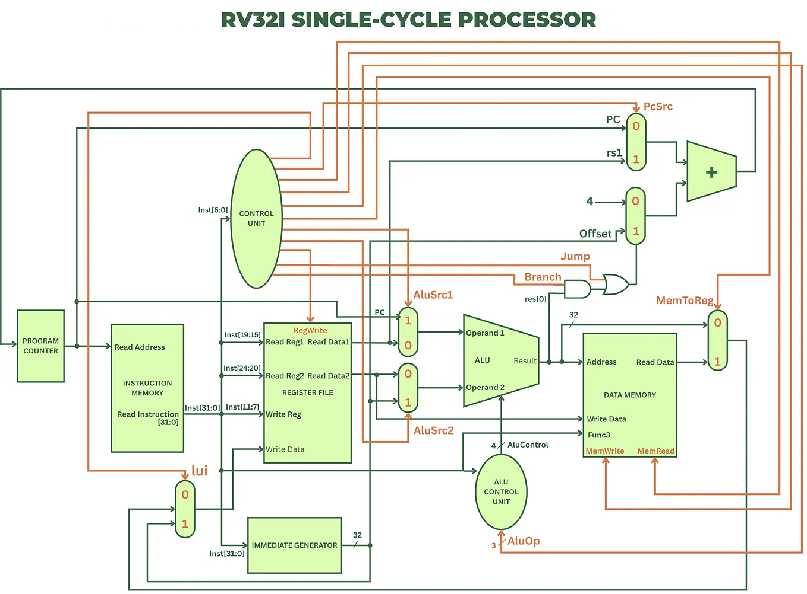

# RV32I SystemVerilog Core

This is a single-cycle 32-bit RISC-V processor (RV32I) built from scratch in SystemVerilog. I created this project to get hands-on experience with computer architecture, datapath routing, and RTL verification.

## Repository Structure

    .
    ├── docs/                                  # Documentation and diagrams
    │   ├── CONCEPT.md                         # Control unit logic and routing details
    │   ├── RV32I_Patterson&Hennessy.png       # Textbook baseline schematic
    │   └── RV32I_SingleCycleProcessor.png     # Full datapath schematic
    ├── rtl/                                   # SystemVerilog RTL source files
    │   ├── alu.sv
    │   ├── alu_control_unit.sv
    │   ├── control_unit.sv
    │   ├── data_memory.sv
    │   ├── immediate_gen.sv
    │   ├── instruction_mem.sv
    │   ├── program_counter.sv
    │   ├── register_file.sv
    │   └── rv32i_core.sv
    ├── testbench/                             # Simulation and verification files
    │   ├── program.hex                        # Assembly test sequence
    │   └── tb.sv                              # Self-checking testbench
    ├── run.bat                                # Windows build script
    └── run.sh                                 # Linux/macOS build script

## Architecture

To build a fully functional RV32I core, I started with the standard single-cycle datapath from *Computer Organization and Design* (Patterson & Hennessy) and extended it to support the full instruction set.

### 1. The Textbook Baseline
The classic Patterson & Hennessy diagram covers the basics (R-type, Load/Store, and basic Branching), but leaves out the hardware needed for things like unconditional jumps and upper immediates.

 
*Image: Computer Organization and Design RISC-V Edition (Patterson & Hennessy)*

### 2. The Full Datapath
To support the complete RV32I base integer instruction set, I added the following modifications to the textbook design:
- **Dual ALU Sources:** Added routing to pass the Program Counter (PC) directly into the ALU (needed for `auipc` and `jal`).
- **Dedicated Writeback Paths:** Added multiplexing to let `lui` and `jal` bypass the ALU and write directly to the Register File.
- **Jump Logic:** Added control signals to handle both conditional branches and unconditional jumps for the next-PC calculation.

 
*Image: [Medium Blog](https://medium.com/@nehanaumankhan/risc-v-single-cycle-processor-datapath-design-scdp-67d452114223)*

This project combines the clean, educational layout of the textbook datapath with the extra routing required to actually run standard RISC-V assembly.

For the control signal truth tables, see [CONCEPT.md](./docs/CONCEPT.md).

### 3. RTL Elaboration (Vivado)
The design has been elaborated using AMD Xilinx Vivado. You can view the hardware-level logic gate schematic generated by the analysis tool here:
* **[Elaborated Design Schematic (PDF)](./vivado/RTL%20Analysis%20Elaborated%20Design_schematic.pdf)**

## Verification

The processor is tested using a self-checking testbench ([testbench/tb.sv](./testbench/tb.sv)). 

Instead of just looking at waveforms, the testbench treats the CPU as a black box. It waits for the clock edge, lets the signals settle, and then verifies that the Register File and Data Memory states match the expected outputs.

### Test Sequence (`program.hex`)
The memory initialization file contains the following hand-assembled machine code sequence. It includes trap instructions to verify that branches and jumps are actually taken (if they fail, the CPU falls through to a trap instruction and writes `100` into `x1`).

| PC Address | Hex Code | RISC-V Assembly | Operation Description |
| :--- | :--- | :--- | :--- |
| `0` | `03200513` | `addi x10, x0, 50` | Load 50 into `x10` |
| `4` | `00f00593` | `addi x11, x0, 15` | Load 15 into `x11` |
| `8` | `00b50633` | `add x12, x10, x11` | `x12` = 50 + 15 = 65 |
| `12` | `40b506b3` | `sub x13, x10, x11` | `x13` = 50 - 15 = 35 |
| `16` | `00c02c23` | `sw x12, 24(x0)` | Store 65 into memory address 24 |
| `20` | `01802703` | `lw x14, 24(x0)` | Load 65 from memory into `x14` |
| `24` | `00e60463` | `beq x12, x14, 8` | If 65 == 65, branch to PC `32` (skips PC `28`) |
| `28` | `06400093` | `addi x1, x0, 100` | **TRAP:** Fails test if branch wasn't taken |
| `32` | `008007ef` | `jal x15, 8` | Jump to PC `40`, link return address (`36`) into `x15` |
| `36` | `06400093` | `addi x1, x0, 100` | **TRAP:** Fails test if jump wasn't taken |
| `40` | `00d70833` | `add x16, x14, x13` | `x16` = 65 + 35 = 100 |
| `44` | `00000063` | `beq x0, x0, 0` | Infinite loop to halt execution |

The testbench programmatically walks through this sequence and covers:
1. R-Type and I-Type ALU operations
2. Memory indexing for `lw` and `sw`
3. ALU branch condition evaluation for `beq`
4. Return address linking for `jal`

## How to Run

The simulation runs on Icarus Verilog and GTKWave. I included scripts to make compiling and testing easy.

Make sure you have Icarus Verilog installed, then run the script for your OS:

**Windows (Command Prompt / PowerShell):**
```cmd
> .\run.bat
```

**Linux / macOS:**
```bash
$ chmod +x run.sh
$ ./run.sh
```